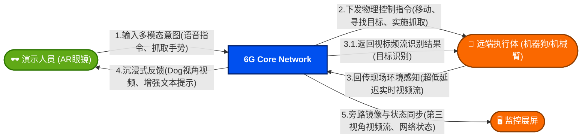
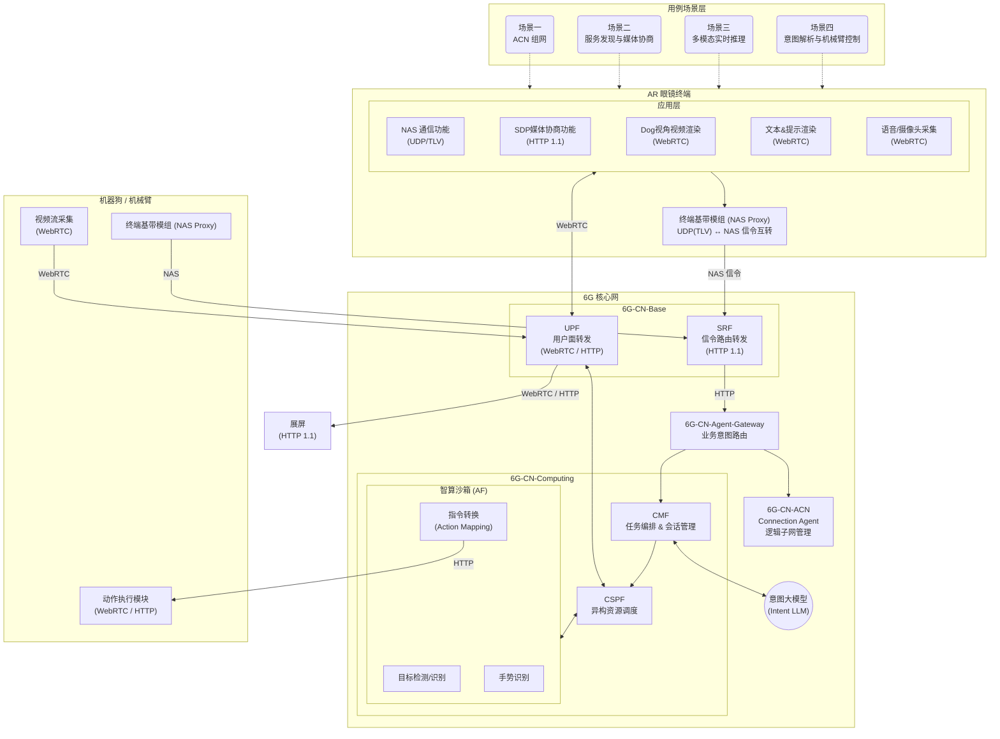
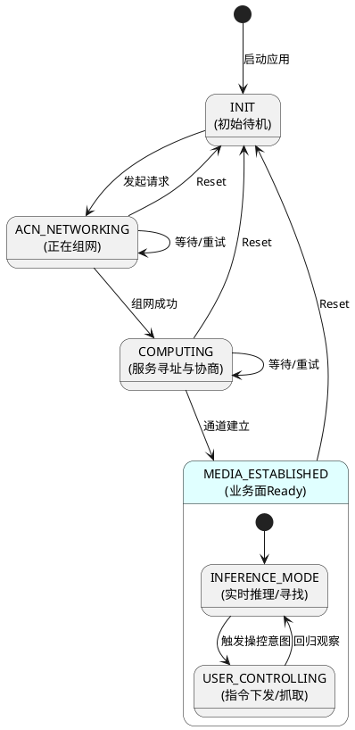
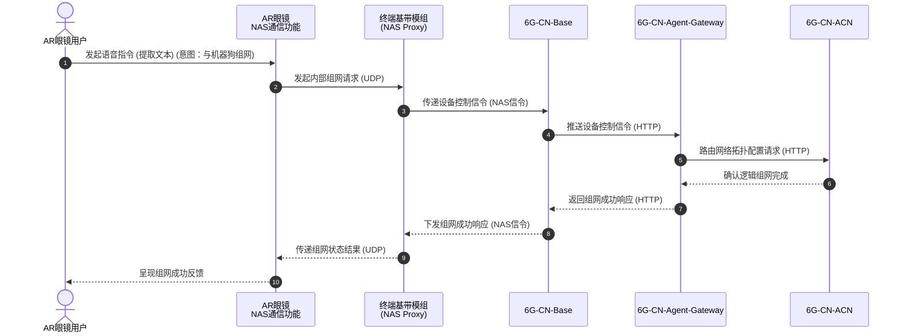
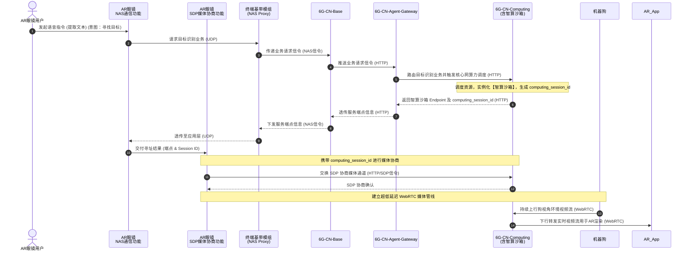
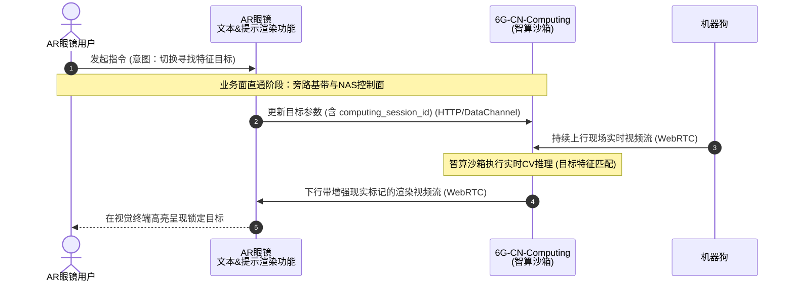
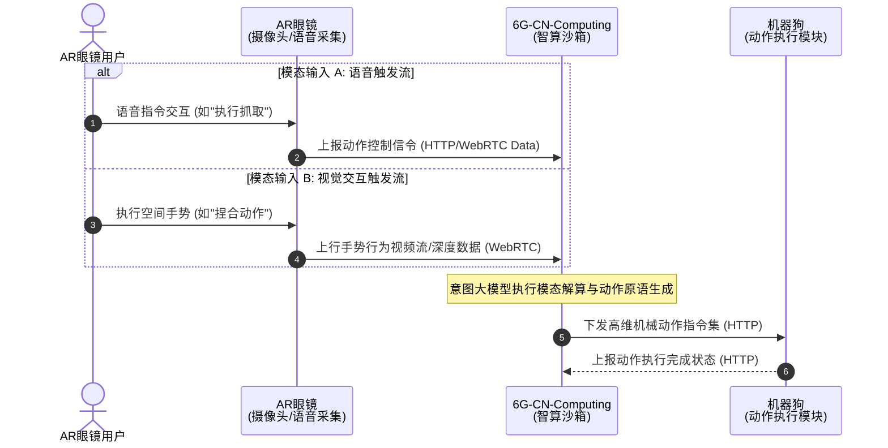
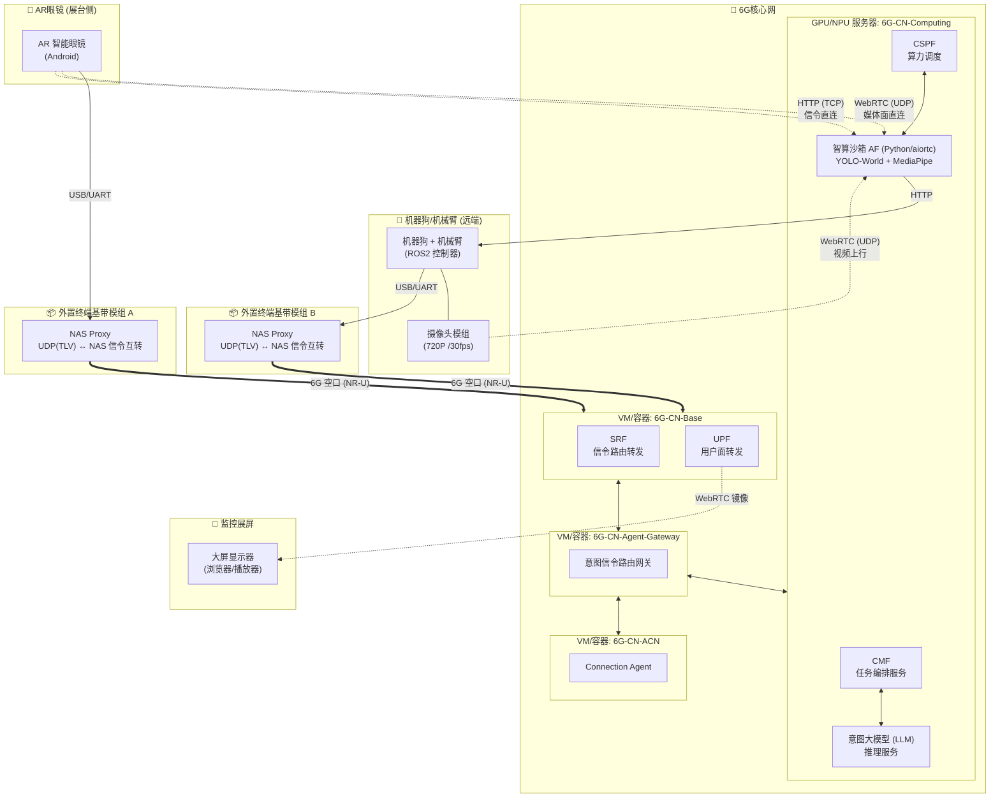

# 1 上海展6G演示样机架构设计文档

## 1.1 版本修订记录

| 版本号  | 修订日期       | 修改说明                                                                        | 修订人    |
| :--- | :--------- | :-------------------------------------------------------------------------- | :----- |
| V0.1 | 2026-03-22 | 初始架构设计，定义核心网与端侧的数据面、控制面交互，场景一至四基础API规范与时序图。                                 | huawei |
| V0.2 | 2026-03-23 | 集成 `computing_session_id` 会话上下文管理，新增拓扑逻辑图。                                  | huawei |
| V0.3 | 2026-03-24 | 补充端侧应用状态机流转设计；根据最新讨论修正核心组件命名（如 CMF、Connection Agent）及相关说明。                  | huawei |
| V0.4 | 2026-03-25 | 场景背景与故事简介中，加入3.1视频流结果回传，优化系统上下文与功能分解图。                                      | huawei |
| V0.5 | 2026-03-29 | 语音转文本由端侧APP完成，AR眼镜与NAS_PROXY之间使用UDP协议承载，新增6G-CN-Agent-Gateway组件，优化逻辑视图与时序图。 | huawei&vivo |
| V0.6 | 2026-03-31 | UDP socket通信部分的接口设计及说明。 | huawei&vivo |
| V0.7 | 2026-04-02 | 意图交互的URL变更。 | huawei&vivo |
| V0.8 | 2026-04-15 | 增加 1.8 章节 WEB 展示界面设计与接口定义，包含三部分 UI 布局方案、SDP 协商、历史指标查询、业务阶段（Stage）及场景（Scene）定义，并修正内部引用与状态对齐。 | huawei&cmcc |


## 1.2 概述
本文档旨在定义一种面向 6G 演进的端网芯多方协作架构；通过 AR 眼镜与具身智能在广域场景下的深度协同，整合 ACN、原生智算及多方算网资源，为”远程机器人协同探索样机“提供系统化的架构指导与技术验证。
### 1.2.1 场景背景与故事简介

本样机展示了一个基于 6G 核心网的“人机协同远程探索”典型场景：
用户佩戴 6G AR 智能眼镜，通过语音指令（AR端侧转译为文本）完成与远端机器狗的自治组网。在 6G 原生智算网络调度下，机器狗采集的实时高清视频流经智算沙箱进行目标识别（如寻找特定的 Labubu 玩偶）与动作分析。用户通过眼镜的增强现实视角感知远端现场，并通过语音或手势操控机器狗完成抓取等复杂动作。该场景验证了 6G 网络在极低延迟通信、任务智能编排及感传算一体化方面的核心能力。

<figure>



<figcaption>图 1-1：系统上下文概览 — 多方协同交互关系</figcaption>
</figure>

## 1.3 系统上下文与功能分解(Context View & Decomposition)

<figure>


<figcaption>图 1-2：系统上下文与功能分解</figcaption>
</figure>

系统上下文定义了用户侧、6G 网络侧与机器人执行侧之间的业务边界与功能协同关系：
*   **终端侧**：AR 眼镜作为用户意图的入口，负责感知数据（语音/视频）的采集与增强现实画面的实时呈现；终端模组保障了业务外设与 6G 网络的高可靠连接。
*   **6G 网络侧**：作为系统的中枢，通过 **CN-Base** 实现高速信令与媒体的中继，由 **CN-Agent-Gateway** 负责控制面业务意图信令的智能路由分发，利用 **CN-ACN** 构建按需服务的逻辑子网，并由 **CN-Computing** 统筹智算沙箱资源，通过意图大模型实现对用户真实需求的深度解析与任务编排。
*   **展示侧**：监控大屏，用于展示6G网络状态、业务状态、用户侧画面、执行侧画面等。
*   **执行侧**：机器狗作为具身智能的载体，负责物理环境的多维感知（视频流）与精准指令执行。

## 1.4 逻辑视图 (Logical View)


### 1.4.1 逻辑视图

以下逻辑视图基于 1.2 系统上下文与功能分解图，展示各子系统的内部功能模块、通信协议及其分层关系。

<figure>



<figcaption>图 1-4：逻辑视图 — 子系统功能模块与协议分层</figcaption>
</figure>

### 1.4.2 逻辑分层说明

| 层次                  | 核心职责                          | 关键协议         |
| ------------------- | ----------------------------- | ------------ |
| **用例场景层**           | 定义四大核心业务场景的触发入口与业务语义          | —            |
| **AR 终端应用层**        | **AR_NAS**: NAS 业务意图通信；**AR_SDP**: SDP 媒体协商；以及视频渲染、语音/视频采集    | HTTP, WebRTC, UDP |
| **终端基带层 (NAS Proxy)** | HTTP/UDP ↔ NAS 信令互转，空口协议适配           | HTTP, UDP, NAS 信令 |
| **6G-CN-Base**      | SRF 信令路由 + UPF 用户面转发          | HTTP, WebRTC |
| **6G-CN-Agent-Gateway** | 业务网关，承接 NAS 控制面意图并智能路由至不同业务系统 | HTTP         |
| **6G-CN-ACN**       | ACN 逻辑子网拓扑初始化与管理              | HTTP         |
| **6G-CN-Computing** | 任务编排与会话管理，统筹调度算力与沙箱           | HTTP         |
| ┗ **CSPF (算力节点)**   | 异构算力资源（NPU/GPU）的映射、调度与流量卸载    | WebRTC, HTTP |
| ┗ **智算沙箱 (AF)**     | 内生 AI 推理（目标检测/识别、手势识别、动作指令转换） | WebRTC, HTTP |
| **意图大模型 (LLM)**     | 多模态语义理解与动作原语生成                | 内部 API       |
| **远端执行体 (机器狗)**   | 现场数据采集回传 + 物理运动原语执行             | WebRTC, HTTP |
| **监控展屏**          | 业务面镜像显示与状态监控                   | WebRTC, HTTP |


### 1.4.3 基带与核心网模块
*   **外置终端模组 (External Terminal Module)**：作为独立的接入硬件，为业务外设（AR眼镜、机器狗）提供 6G 访问能力，负责协议封装与底层通信保障。
*   **6G-CN-Base**：负责传统移动性管理与会话管理（如 AMF/NAS 终结、UPF 转发）。
*   **6G-CN-Agent-Gateway**：核心网业务路由网关，负责接收来自 6G-CN-Base 的 NAS 意图消息，并基于意图类型（组网/计算等）路由至相应的后端服务（6G-CN-ACN 或 6G-CN-Computing）。
*   **6G-CN-ACN**：负责初始阶段的动态组网，构建任务相关的 ACN 逻辑子网，主要包含Connection Agent。
*   **6G-CN-Computing**：架构的计算中枢与业务编排节点，包含算力调度模块 (CSPF) 和智算沙箱 (AF)，负责全链路的意图解析、任务分发与业务流监控。

### 1.4.4 端侧应用状态机设计 (Terminal State Machine)

为保障实际演示效果的健壮性，AR 眼镜端侧应用内置了严格的状态机流转机制，负责处理连接重试、会话保持与业务的无缝切换。状态命名与 API 中的业务意图（`intent_type` 和业务行为）强映射。




<figure>


<figcaption>图 1-5：逻辑视图 — 端侧应用业务状态流转机制</figcaption>
</figure>

**状态流转核心逻辑：**
1. **强依赖阻塞 (`ACN_NETWORKING` & `COMPUTING`)**：作为后续业务的底层通道基础。如果控制面组网或智算寻址握手失败，状态机会停留在当前阶段循环重试，严格验证收到服务端 `SUCCESS` 响应后才能放行，防止下游数据面通信雪崩。
2. **自由切换 (`INFERENCE_MODE` ↔ `USER_CONTROLLING`)**：当媒体底层完毕，进入 `MEDIA_ESTABLISHED` 父状态后。此时允许用户的“语音寻找目标”与“控制原语下发（如手势抓取）”在实时推理和机器控制状态之间无缝交替横跳。
3. **全局复位 (Reset)**：提供一键恢复功能。在系统状态混乱或单次演示完成时，一键发送全局清除指令，释放所有的底层网络会话上下文（摧毁 ACN 子网与沙箱容器），强制应用回到 `INIT` 初始化态备用。


## 1.5 场景时序图(Sequence Diagram)


### 1.5.1 场景一：控制面ACN自动组网

**本场景定义了 AR 终端通过 6G 核心网控制面信令，完成与远端物理执行节点（机器狗）的 ACN (自治通信网络) 逻辑拓扑初始化的过程。**


<figure>



<figcaption>图 1-6：场景一 — 控制面 ACN 自动组网时序图</figcaption>
</figure>

**【架构时序执行步骤】**

1. **意图捕获：** AR 终端采集用户发出的组网语音指令，并在端侧通过 ASR 转写为请求文本。
    
2. **终端内通信：** AR 终端应用层的 NAS（非接入层）通信功能模块，通过内部 UDP 协议向 NAS Proxy 下发组网请求报文。
    
3. **控制面上行：** NAS Proxy 将业务请求封装为标准 NAS 控制信令，经由空中接口上行传输至 6G 核心网的基础控制面（6G-CN-Base）。
    
4. **服务间调用与路由：** 6G-CN-Base 解析 NAS 信令提取寻呼/组网诉求，通过内部 HTTP API 推送至业务路由网关（6G-CN-Agent-Gateway），由其将意图消息路由至自治网络管理功能模块（6G-CN-ACN），发起拓扑配置请求。
    
5. **拓扑建立确认：** 6G-CN-ACN 完成设备鉴权、安全策略下发与虚拟网络实例绑定后，向 6G-CN-Agent-Gateway 确认逻辑组网完成，并最终返回至 6G-CN-Base。
    
6. **控制面下行：** 6G-CN-Base 经由控制面下行链路，将组网成功的状态字封装入 NAS 信令，发送至 NAS Proxy。
    
7. **状态透传：** NAS Proxy 解封装 NAS 信令，通过 UDP 回调机制向上层应用（NAS 通信模块）透传组网成功状态。
    
8. **终端反馈：** AR 终端接收状态后，通过 UI 界面向用户呈现组网成功的交互反馈。
    

---

### 1.5.2 场景二：智算沙箱服务发现与媒体流协商

**本场景描述了终端依托 6G 核心网控制面完成智算服务的寻址与沙箱实例化，并最终在应用层完成 SDP 协商以建立端到端 WebRTC 媒体流通道的完整生命周期。**

<figure>



<figcaption>图 1-7：场景二 — 智算沙箱服务发现与媒体流协商时序图</figcaption>
</figure>

**【架构时序执行步骤】**

1. **意图捕获：** AR 终端捕捉用户出发空间目标检测与识别业务的语音指令，由 **AR_NAS** 模块进行文本提取。
    
2. **终端内请求：** **AR_NAS** 通过 UDP 协议向 NAS Proxy 发起“目标识别服务”的业务寻址与连接请求。
    
3. **寻址信令上行：** NAS Proxy 将业务请求封装并映射为 NAS 信令，透传至 6G-CN-Base。
    
4. **触发算网协同：** 6G-CN-Base 经意图解析后将诉求推送至 6G-CN-Agent-Gateway，网关识别到目标识别的计算负荷诉求，路由至算网融合中枢（6G-CN-Computing），触发核心网算力调度策略。
    
5. **算力节点实例化：** 6G-CN-Computing 动态分配异构算力（如 NPU/GPU），实例化专用的“智算沙箱（AI Sandbox）”服务进程，并产生唯一的 `computing_session_id` 作为该业务流的上下文标识。
    
6. **寻址信令下行：** 算力节点分配的服务端点信息与 `computing_session_id` 经网关透传回 6G-CN-Base，随后封装于 NAS 信令的 PDU 中下发至 NAS Proxy。
    
7. **端点透传：** NAS Proxy 解包后，通过 UDP 将该核心网算力的服务端点及 `computing_session_id` 透传回 **AR_NAS** 模块。
    
8. **功能接续与触发：** **AR_NAS** 将获取的沙箱 Endpoint 交付给 **AR_SDP** 模块，触发后续的媒体协商逻辑。
    
9. **媒体通道协商：** **AR_SDP** 通过用户面 HTTP 链路直接与智算沙箱端点通信，在信令中携带 `computing_session_id`，利用 SDP 交换发起 WebRTC 媒体面能力协商。
    
10. **握手确认：** 智算沙箱完成参数匹配，通过 HTTP 返回 SDP 确认，双方成功建立 WebRTC 实时媒体管线。
    
11. **现场态势感知：** 远端执行体（机器狗）利用已建立的 ACN 拓扑，向智算沙箱上行推送第一人称视角的实时环境视频流。
    
12. **端侧沉浸渲染：** 智算沙箱将处理后的增强视频流，经由 WebRTC 下行管线转发至 AR 终端（**AR_App 渲染模块**），供其内置渲染引擎呈现视口画面。
    

---

### 1.5.3 场景三：多模态实时推理

**本场景展示了在媒体通道建立后，完全通过端到端直连数据面实现低延迟指令下发与核心网实时 CV 推理渲染的过程。**

<figure>



<figcaption>图 1-8：场景三 — 多模态实时推理时序图</figcaption>
</figure>

**【架构时序执行步骤】**

1. **意图捕获：** AR 终端接收用户关于变更搜索主体的热切换语音指令（如限定颜色、类别），在终端本地转为文本。
    
2. **数据面直连交互：** AR 终端应用层直接旁路 NAS 控制层，在请求中携带 `computing_session_id`，利用 HTTP API 或 WebRTC Data Channel，向智算沙箱发送目标特征属性的更新参数。
    
3. **现场态势流转：** 机器狗保持基于 WebRTC 的宽带媒体通道，持续上行实时现场视频流。
    
4. **核心网实时推理：** 智算沙箱在核心网算力侧截获视频流，并基于步骤 2 更新的特征参数，调用大视觉模型（Vision Model）在视频帧序列中执行高频、低延迟的计算机视觉（CV）目标检测与特征匹配计算。
    
5. **增强现实流下推：** 智算沙箱将叠加了空间坐标映射数据（如 Bounding Box、Mask 等）的增强渲染后视音频流，经由 WebRTC 下行管线推送至 AR 终端。
    
6. **视口呈现：** AR 终端利用内置的文本与提示渲染模块，解析复合流数据，在用户的光学透视视野中精确追踪并高亮锁定物理目标。
    

---

### 1.5.4 场景四：多模态意图解析与机械臂控制

**本场景阐释了算网协同架构如何接收终端采集的异构多模态（语音/视觉）输入，经由意图大模型融合解析后，转化为确定的物理运动学指令并下发至机械执行器的闭环控制链路。**

<figure>



<figcaption>图 1-9：场景四 — 多模态意图解析与机械臂控制时序图</figcaption>
</figure>

**【架构时序执行步骤】**

1. **语音模态触发（分支A）：** 用户发出捕捉意图的语音指令，AR 终端经由 ASR 提取为文本信息。
    
2. **语音信令上行（分支A）：** AR 终端通过既有的 HTTP 连接或 WebRTC Data Channel，将提取的语意文本信息上报至核心网算力中心（6G-CN-Computing）。
    
3. **空间模态触发（分支B）：** 用户利用手部进行六自由度（6DoF）空间交互操作，终端前置摄像头阵列捕获环境与手势运动。
    
4. **视觉流数据上行（分支B）：** AR 终端利用宽带 WebRTC 通道，将包含手部关节点的深度信息或高帧率 RGB 视频流实时上推至算力节点。
    
5. **意图融合与解算（统一入口）：** 6G-CN-Computing 内部的“意图大模型”作为决策中枢，接收异构模态数据，执行语义解析或空间姿态估计计算，将用户的宏观交互意图转换为机器可读的精确运动控制原语（Kinematic Control Primitives）。
    
6. **运动控制指令分发：** 算力节点利用 HTTP 强可靠链路，将生成的控制原语集下发至远端执行体的底层控制模块。
    
7. **执行状态闭环反馈：** 机械部件完成物理致动后，通过 HTTP 上行链路向算力中枢发送动作执行结果（如抓取成功、超时等），完成系统控制闭环。


## 1.6 部署视图 (Deployment View)

以下部署视图展示系统各软件组件在物理节点上的部署映射，以及节点之间的网络连接拓扑。

<figure>



<figcaption>图 1-10：部署视图 — 物理节点与软件组件映射</figcaption>
</figure>

### 1.6.1 部署节点说明

| 物理节点 | 部署组件 | 硬件形态 | 网络接入 |
|---------|---------|---------|---------|
| **AR 眼镜** | AR 眼镜应用（采集/渲染） | 智能眼镜 (Android/HarmonyOS) | USB/WIFI → 外置模组 |
| **外置终端基带模组** | NAS Proxy（UDP(TLV) ↔ NAS 信令互转） | 独立外置 USB 硬件模组 | 6G NR-U 空口 |
| **机器狗/机械臂** | 机器狗控制器 + 摄像头 | ROS2 主机 | USB → 外置模组 |
| **6G 核心网** | 6G-CN-Base (SRF/UPF)、CN-Agent-Gateway、CN-ACN、CN-Computing (编排/CSPF/沙箱/LLM) | x86 + GPU/NPU 服务器集群 | 数据中心内网 |
| **监控展屏** | 浏览器或流媒体播放器 | 大屏显示器 | 有线/WiFi |

### 1.6.2 部署实体间主要协议

| 网段 | 协议 | 用途 |
|------|------|------|
| 终端 ↔ 核心网 (控制面) | NAS over 6G NR-U | 组网信令、服务发现 |
| AR 眼镜 ↔ 智算沙箱 (用户面) | WebRTC (UDP) + HTTP (TCP) | 媒体流、SDP 协商、意图指令 |
| 机器狗 ↔ 智算沙箱 (用户面) | WebRTC (UDP) + HTTP (TCP) | 视频上行、动作指令下发 |
| 核心网内部 | HTTP (TCP) | CN-Base ↔ CN-Agent-Gateway ↔ CN-ACN/CN-Computing 服务间调用 |
| 核心网 → 展屏 | WebRTC / HTTP | 旁路镜像视频流 |

## 1.7 接口说明

> **目标设备路由说明**：场景一/二（控制面业务数据报，通过 UDP 承载端侧请求）的目标终端 IP 为 `10.6.1.1`（即 NAS Proxy 的 IPv4 地址，抵达后被封装入下行/上行 NAS 信令），场景三/四的接口 Host 为智算沙箱 IPv4 地址 `10.6.100.1:8443`（应用层直连，彻底旁路 NAS 控制面）。

### 1.7.1 公共接口：意图信令 UDP 承载层 (AR眼镜 ↔ NAS_PROXY)

本章节定义了用于承载 1.7.2（场景一）与 1.7.3（场景二）中 **步骤 2** 和 **步骤 9** 业务信令的底层公共通信接口。该接口严格用于 AR 眼镜与 NAS_PROXY 之间的通信。

**数据流转与反序列化机制**：
1. **传输层协议**：UDP。
2. **端侧封包（步骤 2）**：1.7.2 / 1.7.3 所述的意图请求在业务层构造为 JSON 后，AR 眼镜应用层统一将其封装进 UDP 数据报中。上行方向该数据报的 Payload中包括两部分内容，length（4字节）作为content的长度指示，可用于做数据报完整性检验；content（可变长）为前述完整的 JSON 字符串。下行方向的payload中包括三部分内容，status，length和content，其中length与content的设定与上行方向完全相同，status为enum类型，用于表示当前的终端协议栈处理状态，0：PROCESSING，1：OK， 2：NG
该UDP socket只用于意图通信，收到上行socket消息且长度校验通过后，将content部分封装在定制化NAS信令中，发送到网侧；NAS收到下行的响应信令后，封装于下行socket消息，并进行发送；状态2：NG可能产生的原因包括TIMEOUT，内部处理异常等
3. **网侧解包与路由（步骤 2 下半程）**：上述封装报文对 NAS_PROXY 是完全透明的（其将其作为业务流直接装入 NAS 隧道透传）。待 NAS 信令达到核心网由 6G-CN-BASE 终结并提取payload后，6G-CN-BASE 将对其 进行透传处理发送到核心网内的 **6G-CN-Agent-Gateway** 的固定路由URL地址`/nagent-intent/v1/intent/{supi}`进行后续分发处理，URL中的supi为接入6G-CN-BASE并发起意图的UE对应的SUPI。
4. **反向回传（步骤 9）**：网络下行链路遵循相反的路径与封装机制。由 6G-CN-BASE 将下行响应封装入具有定制化NAS消息中，再沿下行 NAS 信令层透传回至终端模组，抵达 AR 眼镜侧完成解包。

**UDP Payload 指令格式**：
>上行方向

| 字段 | 结构格式 | 描述 |
|------|-----------|------|
| `LENGTH` | uint32_t | 用于指示用户意图长度 |
| `CONTENT` | string | 可变长，承载json编码后的用户意图 |

>下行方向

| 字段 | 结构格式 | 描述 |
|------|-----------|------|
| `STATUS` | enum | 0：PROCESSING，1：OK， 2：NG |
| `LENGTH` | uint32_t | 用于指示处理结果的长度，当STATUS=1时有效 |
| `CONTENT` | string | 可变长，承载json编码后的处理结果 |


---

### 1.7.2 场景一：ACN 组网接口 (AR_NAS ↔ 核心网)

本接口在应用层定义规范展示为 JSON 报文，但实际上如 1.7.1 节所述，其实际跨越 AR 外围链路时被封装为 UDP 承载。其余业务交互参数均完全一致，对应场景一时序图中的 **步骤 2（上行请求）** 和 **步骤 9（下行响应）**。

#### 1.7.2.1 步骤 2：上行组网请求 (AR_NAS → 核心网)

```
{
  "request_id": "req-acn-20260322-001",
  "intent_type": "ACN_NETWORKING",
  "intent_payload": "与机器狗组网",
  "source_device": {
    "device_id": "ar-glasses-vivo-001",
    "device_type": "AR_GLASSES"
  }
}
```

| 字段 | 类型 | 说明 |
|------|------|------|
| `request_id` | string | 唯一请求标识 |
| `intent_type` | enum | `ACN_NETWORKING` / `COMPUTING` / `UNKNOWN` |
| `source_device` | object | 发起端设备信息 |
| `target_device` | object | 目标端设备信息（组网对端） |
| `intent_payload` | string | 语音指令转写后的文本内容 |

---

#### 1.7.2.2 步骤 9：下行组网状态响应 (核心网 → AR_NAS)

```
{
  "request_id": "req-acn-20260322-001",
  "status": "SUCCESS",
  "acn_session": {
    "session_id": "acn-sess-78a3b1",
    "members": [
      {
        "device_id": "ar-glasses-vivo-001",
        "role": "CONTROLLER",
        "ip": "10.6.10.1"
      },
      {
        "device_id": "dog-huawei-001",
        "role": "EXECUTOR",
        "ip": "10.6.10.2"
      }
    ]
  }
}
```

| 字段 | 类型 | 说明 |
|------|------|------|
| `request_id` | string | 与上行请求一致，用于关联 |
| `status` | enum | `SUCCESS` / `FAILED` / `TIMEOUT` |
| `acn_session` | object | 成功时返回的 ACN 逻辑子网会话信息 |
| `session_id` | string | ACN 会话唯一标识 |
| `members[]` | array | 当前子网成员列表及其角色与 IP |

---

### 1.7.3 场景二：智算沙箱服务发现与媒体协商接口

本节定义了场景二中的关键 JSON 接口，覆盖 **步骤 2/9（服务发现）** 和 **步骤 10/11（SDP 媒体协商）** 两个阶段。如 1.7.1 节所述，服务发现阶段（步骤 2/9）的底层以 UDP 协议穿透端侧；而媒体协商（步骤 10/11）由应用层绕过直接发向沙箱 Endpoint。

#### 1.7.3.1 步骤 2：上行算力服务请求 (AR_NAS → 核心网)

请求结构与场景一类似，`intent_type` 设为 `COMPUTING`，语音数据承载用户的寻找目标意图。

```
{
  "request_id": "req-comp-20260322-001",
  "intent_type": "COMPUTING",
  "intent_payload": "开始寻找Labubu",
  "source_device": {
    "device_id": "ar-glasses-vivo-001",
    "device_type": "AR_GLASSES"
  }
}
```

| 字段 | 类型 | 说明 |
|------|------|------|
| `intent_type` | enum | 固定为 `COMPUTING` |
| `acn_session_id` | string | 场景一中已建立的 ACN 会话 ID |
| `intent_payload` | string | 语音指令转写后的文本内容 |

---

#### 1.7.3.2 步骤 9：下行服务端点响应 (核心网 → AR_NAS)

核心网完成算力调度与沙箱实例化后，将沙箱的 HTTP 服务端点返回给 AR 应用层。

```
{
  "request_id": "req-comp-20260322-001",
  "status": "SUCCESS",
  "computing_session_id": "comp-sess-aff2-91bc",
  "computing_type": "Sandbox",
  "computing_instance": {
    "id": "2bb772f4-cebb-4554-a49f-5b4ba9470c53",
    "host": "10.6.100.1",
    "port": 8443,
    "sdp_url": "https://10.6.100.1:8443/api/v1/sdp/offer"
  }
}
```

| 字段 | 类型 | 说明 |
|------|------|------|
| `computing_session_id` | string | 智算业务会话 ID，后续交互需携带此 ID 作为上下文 |
| `sandbox_endpoint` | object | 已实例化的智算沙箱服务端点信息 |
| `host` | string | 沙箱 IPv4 地址 |
| `port` | integer | 服务端口 |
| `sdp_url` | string | 后续 SDP 协商的完整 URL（步骤 10 直接使用） |

---

#### 1.7.3.3 步骤 10：SDP Offer (AR_SDP → 智算沙箱)

AR 眼镜应用层内的 SDP 媒体协商功能利用步骤 9 返回的 `sdp_url`，通过标准的**用户面 HTTP 协议**，直接绕过底层的 NAS 控制面，向智算沙箱端点发送 SDP Offer，发起 WebRTC 媒体通道协商。

```
POST /api/v1/sdp/offer HTTP/1.1
Host: 10.6.100.1:8443
Content-Type: application/json

{
  "sdp_offer": {
    "type": "offer",
    "sdp": "v=0\r\no=- 4625943417711145 2 IN IP4 10.6.10.1\r\n..."
  }
}
```

| 字段 | 类型 | 说明 |
|------|------|------|
| `acn_session_id` | string | ACN 会话 ID |
| `sdp_offer.sdp` | string | 标准 WebRTC SDP Offer 文本 |

---

#### 1.7.3.4 步骤 11：SDP Answer (智算沙箱 → AR_SDP)

智算沙箱完成参数匹配后，通过全链路的用户面 HTTP 响应返回 SDP Answer 至终端的 SDP 媒体协商组件，双方随后自动完成 ICE/DTLS 握手建联。

```
HTTP/1.1 200 OK
Content-Type: application/json

{
  "status": "SUCCESS",
  "sdp_answer": {
    "type": "answer",
    "sdp": "v=0\r\no=- 7890123456789 2 IN IP4 10.6.100.1\r\n..."
  }
}
```

| 字段 | 类型 | 说明 |
|------|------|------|
| `sdp_answer.sdp` | string | 标准 WebRTC SDP Answer 文本 |

---

### 1.7.4 场景三：目标特征切换接口 (AR_App → 智算沙箱)

本接口对应场景三时序图 **步骤 2**。媒体通道已建立，AR 应用层直接向智算沙箱发送语音转译的文本指令，由沙箱侧解析目标切换意图，**全程旁路基带与 NAS 控制面**。

> **协议说明**：本场景中所有控制信令**首选 HTTP 协议**（保证高可靠性与不丢包），但也支持通过已建立的 **WebRTC Data Channel** 进行交互，适用于对实时性要求更高、可容忍偶发丢包的场景。


#### 1.7.4.1 步骤 2：语音目标切换请求 (AR_App → 智算沙箱)

```
POST /api/v1/inference/intent HTTP/1.1
Host: 10.6.100.1:8443
Content-Type: application/json

{
  "acn_session_id": "acn-sess-78a3b1",
  "computing_session_id": "comp-sess-aff2-91bc",
  "action": "VOICE_COMMAND",
  "intent_payload": "寻找红色Labubu"
}
```

| 字段 | 类型 | 说明 |
|------|------|------|
| `computing_session_id` | string | 智算业务会话 ID |
| `action` | enum | `VOICE_COMMAND` / `VISUAL_COMMAND` |
| `intent_payload` | string | 语音指令转写后的文本内容 |

---

#### 1.7.4.2 响应：确认 (智算沙箱 → AR_App)

```
HTTP/1.1 200 OK
Content-Type: application/json

{
  "request_id": "req-target-20260322-001",
  "status": "OK"
}
```

> 沙箱收到文本指令后，内部执行意图解析 → 特征参数更新，后续视频帧的 CV 推理将自动匹配新目标，无需额外握手。

---

### 1.7.5 场景四：多模态意图解析与机械臂控制接口

本节覆盖场景四时序图的全部步骤，分为 **分支 A（语音抓取）** 和 **分支 B（手势抓取）** 两条输入路径，以及 **统一的动作下发与闭环反馈** 接口。

> **协议说明**：本场景中所有控制信令**首选 HTTP 协议**（保证高可靠性与不丢包），但也支持通过已建立的 **WebRTC Data Channel** 进行交互，适用于对实时性要求更高、可容忍偶发丢包的场景。

---

#### 1.7.5.1 分支 A — 步骤 1/2：语音抓取指令 (AR_App → 智算沙箱)

AR 眼镜采集用户语音并在端侧转化为文本后上传至沙箱，由沙箱侧意图大模型完成语义解析。

```
POST /api/v1/action/voice HTTP/1.1
Host: 10.6.100.1:8443
Content-Type: application/json

{
  "request_id": "req-action-voice-20260322-001",
  "acn_session_id": "acn-sess-78a3b1",
  "computing_session_id": "comp-sess-aff2-91bc",
  "action": "VOICE_COMMAND",
  "intent_payload": "抓取Labubu"
}
```

| 字段 | 类型 | 说明 |
|------|------|------|
| `computing_session_id` | string | 智算业务会话 ID |
| `action` | enum | `VOICE_COMMAND` / `VISUAL_COMMAND` |
| `intent_payload` | string | 语音指令转写后的文本内容 |

**响应**（沙箱已受理，进入意图解算）：

```
HTTP/1.1 200 OK
Content-Type: application/json

{
  "request_id": "req-action-voice-20260322-001",
  "status": "ACCEPTED",
  "message": "Voice intent received, processing action primitives"
}
```

---

#### 1.7.5.2 分支 B — 步骤 3/4：手势抓取指令 (AR_App → 智算沙箱)

AR 眼镜前置摄像头采集用户手势视频流/深度数据，通过已建立的 WebRTC 媒体通道上行，并以 HTTP 信令通知沙箱启动手势识别模式。

**HTTP 信令激活请求**：

```
POST /api/v1/action/gesture HTTP/1.1
Host: 10.6.100.1:8443
Content-Type: application/json

{
  "request_id": "req-action-gesture-20260322-001",
  "acn_session_id": "acn-sess-78a3b1",
  "computing_session_id": "comp-sess-aff2-91bc",
  "action": "VISUAL_COMMAND"
}
```

| 字段 | 类型 | 说明 |
|------|------|------|
| `computing_session_id` | string | 智算业务会话 ID |
| `action` | enum | `VOICE_COMMAND` / `VISUAL_COMMAND` |
| `video` (binary) | file | 包含手势特征的视频流/深度数据 |

> **注意**：手势视频流本身通过已建立的 WebRTC 媒体通道实时上传，此 HTTP 请求仅用于通知沙箱切换至手势识别推理模式。

**响应**（沙箱已激活手势识别管线）：

```
HTTP/1.1 200 OK
Content-Type: application/json

{
  "request_id": "req-action-gesture-20260322-001",
  "status": "ACCEPTED",
  "message": "Gesture recognition pipeline activated"
}
```

---

#### 1.7.5.3 步骤 5/6：动作指令下发 (智算沙箱 → 机器狗)

沙箱经 LLM 意图解算后，生成运动学控制原语，通过 HTTP 下发至机器狗动作执行模块。

```
POST /api/v1/robot/execute HTTP/1.1
Host: 10.6.10.2:8080
Content-Type: application/json

{
  "command_id": "cmd-grab-20260322-001",
  "acn_session_id": "acn-sess-78a3b1",
  "computing_session_id": "comp-sess-aff2-91bc",
  "action_type": "GRAB"
}
```

| 字段 | 类型 | 说明 |
|------|------|------|
| `computing_session_id` | string | 智算业务会话 ID |
| `command_id` | string | 指令唯一标识 |
| `action_type` | enum | `GRAB` / `MOVE` / `RELEASE` / `SEARCH` |

---

#### 1.7.5.4 步骤 7：执行状态闭环反馈 (机器狗 → 智算沙箱)

机器狗完成物理动作后，上报执行结果，完成系统闭环。

```
POST /api/v1/robot/feedback HTTP/1.1
Host: 10.6.100.1:8443
Content-Type: application/json

{
  "command_id": "cmd-grab-20260322-001",
  "computing_session_id": "comp-sess-aff2-91bc",
  "status": "SUCCESS"
}
```

| 字段 | 类型 | 说明 |
|------|------|------|
| `computing_session_id` | string | 智算业务会话 ID |
| `command_id` | string | 与下发指令关联的唯一标识 |
| `status` | enum | `SUCCESS` / `FAILED` / `TIMEOUT` |

**沙箱确认**：

```
HTTP/1.1 200 OK
Content-Type: application/json

{
  "command_id": "cmd-grab-20260322-001",
  "status": "OK"
}
```

## 1.8 WEB 展示界面

本章节定义了用于支撑大屏 WEB 展示界面的后端交互接口。监控展屏通过这些接口获取实时的媒体流、性能指标（用于曲线绘制）以及系统架构的消息状态流转动态。

### 1.8.1 WEB 界面设计

本节定义了监控展屏的 UI 布局原型。界面采用**三部分非对称布局**，旨在直观展示 6G 端网芯协同的效果。

#### 1.8.1.1 核心网 UI 设计 (scene_core)

核心网场景突出 **6G 原生智算** 与 **内生算力卸载** 路径。

*   **布局架构**：
    *   **左上 (Vision & Feedback)**：机器狗视角 720P 实时画面，叠加由核心网沙箱渲染生成的 AI 目标识别框（Bounding Box）；同步叠加显示实时提示语（对应 1.8.5 节 `message` 字段）。
    *   **左下 (Data & Logs)**：复合监控看板。包含实时性能曲线（展示 E2E Latency、Jitter、FPS，对应 1.8.3 节数据）或 业务流转日志。
    *   **右侧 (Dynamic Architecture)**：全屏高度的 6G 架构拓扑图。根据 `current_stage` 实时高亮显示当前激活节点（如 `6G-CN-Computing` 与 `智算沙箱`），并在各网元间渲染动态的消息流动动画。

<figure>


<figcaption>图 8-1：核心网UI原型图</figcaption>
</figure>


#### 1.8.1.2 公有云 UI 设计 (scene_cloud)

公有云场景作为对比组，展示传统算力卸载路径。

*   **差异化体现**：
    *   **右侧 (Dynamic Architecture)**：拓扑图高亮路径切换至外部“公有云”分支，显示数据流绕行外部网络的轨迹。
    *   **左下 (Data & Logs)**：性能曲线显示相对较高的时延与抖动，通过对比凸显 6G 核心网内生算力的优势。

<figure>


<figcaption>图 8-1：公有云UI原型图</figcaption>
</figure>


### 1.8.2 WEB 媒体流 SDP 协商接口 (Web端 ↔ 智算沙箱)

为了在 WEB 界面上展示机器狗视角的实时回传视频（或渲染后的视频）、以及旁路镜像画面，Web 端需与智算沙箱建立对应的 WebRTC 媒体通道。本接口兼容 1.7 章节的 SDP 媒体协商规范，**ICE Candidate 信息直接集成在 SDP 报文中承载**，无需额外的信令交换步骤。

**请求 (Web 端 → 智算沙箱)：**

```http
POST /api/v1/web/sdp/offer HTTP/1.1
Host: 10.6.100.1:8443
Content-Type: application/json

{
  "client_id": "web-monitor-display-01",
  "sdp_offer": {
    "type": "offer",
    "sdp": "v=0\r\no=- 4625943417711145 2 IN IP4 10.6.10.100\r\n...\r\na=candidate:..."
  }
}
```

**响应 (智算沙箱 → Web 端)：**

```http
HTTP/1.1 200 OK
Content-Type: application/json

{
  "status": "SUCCESS",
  "sdp_answer": {
    "type": "answer",
    "sdp": "v=0\r\no=- 7890123456789 2 IN IP4 10.6.100.1\r\n...\r\na=candidate:..."
  }
}
```

> **注**：为简化 Web 端实现，采用 Non-Trickle ICE 模式，所有可用 Candidate 均包含在上述 SDP 块中，一次性完成媒体能力与地址信息的交换。

---

### 1.8.3 网络性能与历史指标接口 (Web端 ↔ 6G-CN-Computing)

由 `6G-CN-Computing` 暴露的数据查询接口，用于获取端到端 (E2E) 时延、抖动等历史与实时监控数据，支撑 WEB 界面的动态曲线渲染。

**请求 (Web 端 → 6G-CN-Computing)：**

```http
GET /api/v1/metrics/history?time_window=300 HTTP/1.1
Host: 10.6.100.1:8443
```

- `time_window`：查询的历史时间范围，单位为秒（如统计过去 300 秒的数据）。

**响应：**

```http
HTTP/1.1 200 OK
Content-Type: application/json

{
  "status": "SUCCESS",
  "metrics": [
    {
      "timestamp": 1679450000,
      "e2e_latency_ms": 12.4,
      "jitter_ms": 2.1,
      "compute_latency_ms": 5.2,
      "processing_latency_ms": 4.1,
      "fps": 30
    },
    {
      "timestamp": 1679450001,
      "e2e_latency_ms": 11.8,
      "jitter_ms": 1.5,
      "compute_latency_ms": 4.8,
      "processing_latency_ms": 3.9,
      "fps": 30
    }
    // ... 历史采样数据点数组
  ]
}
```

| 字段 | 类型 | 说明 |
|------|------|------|
| `timestamp` | integer | 采样时间戳（Unix 时间戳，秒） |
| `e2e_latency_ms` | float | **端到端总时延**（毫秒），即从机器狗摄像头采集，到最终在 AR 眼镜屏幕渲染呈现的总耗时 |
| `jitter_ms` | float | **网络时延抖动**（毫秒），反映 6G 空口与传输链路稳定性的核心网络指标 |
| `compute_latency_ms` | float | **AI 计算推理时延**（毫秒），视频帧进入智算沙箱后，执行目标检测/手势识别等 AI 模型的纯计算耗时 |
| `processing_latency_ms` | float | **系统处理时延**（毫秒），智算沙箱内视频解码、重编码、以及叠加增强现实画框等管线的处理耗时 |
| `fps` | integer | **实时帧率**（FPS），当前沙箱处理完毕并下行推流的视频画面帧率 |

---

### 1.8.4 系统业务阶段与动画控制接口 (Web端 ↔ 核心网)

此接口上报当前系统架构所处的宏观业务阶段（Stage）。WEB 端通过轮询或长连接获取当前阶段标识，用于整体切换架构拓扑图的显示模式，并触发与之对应的网元高亮与消息流动动画。

**请求 (Web 端 → 核心网)：**

```http
GET /api/v1/system/topology/stage HTTP/1.1
Host: 10.6.100.1:8443
```

**响应：**

```http
HTTP/1.1 200 OK
Content-Type: application/json

{
  "status": "SUCCESS",
  "current_stage": "ACN_NETWORKING",
  "scene": "scene_core",
  "timestamp": 1679450010
}
```

| 字段 | 类型 | 说明 |
|------|------|------|
| `status` | string | 业务处理状态 |
| `current_stage` | string | **当前宏观业务阶段标识**，见下表 Stage 定义 |
| `scene` | string | **当前演示场景标识**，见下表 Scene 定义 |
| `timestamp` | integer | 服务器系统时间戳 |

**Scene 演示场景定义：**

| Scene | 场景名称 | 业务含义 |
|-------|---------|----------|
| scene_core | 核心网场景 | 基于 6G 核心网内生算力的演示场景，算力卸载至核心网智算沙箱 |
| scene_cloud | 公有云场景 | 基于传统公有云算力的演示场景，用于与核心网算力进行性能对比 |

**Stage 阶段定义 (对齐端侧状态机)：**

| Stage | 阶段名称 | 含义 | 动画效果 |
|-------|---------|------|----------|
| INIT | INIT | 系统初始待机状态 | 所有节点灰色显示，无动画 |
| ACN_NETWORKING | ACN_NETWORKING | 控制面 ACN 自动组网阶段 | ACN 相关节点高亮，信令流动动画 |
| COMPUTING | COMPUTING | 智算沙箱服务发现与媒体协商阶段 | Computing 相关节点高亮，媒体流动画 |
| MEDIA_ESTABLISHED | MEDIA_ESTABLISHED | 业务面完全建立，实时推理与控制阶段 | 全链路节点高亮，持续数据流动动画 |

---

### 1.8.5 AR 眼镜实时业务状态接口 (Web端 ↔ 核心网)

此接口用于获取 AR 眼镜当前的具体业务执行状态。与宏观的 Stage 接口不同，此接口更聚焦于端侧的业务逻辑（如目标锁定、手势识别结果、环境感知状态等），并提供人性化的文字提示语，用于在 WEB 端界面的“状态栏”或“提示区”实时显示。

**请求 (Web 端 → 核心网)：**

```http
GET /api/v1/system/ar/status HTTP/1.1
Host: 10.6.100.1:8443
```

**响应：**

```http
HTTP/1.1 200 OK
Content-Type: application/json

{
  "status": "SUCCESS",
  "ar_status": "INIT",
  "message": "系统就绪，等待演示开始...",
  "timestamp": 1679450015
}
```

| 字段 | 类型 | 说明 |
|------|------|------|
| `status` | string | 业务处理状态 |
| `ar_status` | string | **AR 业务状态标识**，与 1.8.4 节 Stage 标识完全对齐 |
| `message` | string | **人性化提示语**，直接用于 UI 界面显示的文本内容 |
| `timestamp` | integer | 服务器系统时间戳 |

**AR 业务状态定义 (对齐 Stage)：**

| ar_status | 提示语示例 (message) | 对应 Stage | 业务含义 |
|-----------|----------------------|------------|----------|
| INIT | 系统就绪，等待演示开始 | INIT | 初始待机状态 |
| ACN_NETWORKING | 正在进行 6G ACN 自动组网... | ACN_NETWORKING | 控制面组网阶段 |
| ACN_COMPLETE | 已经完成 6G ACN 组网... | COMPUTING | 控制面组网成功 |
| COMPUTING | 智算沙箱寻址与媒体协商中... | COMPUTING | 服务寻址阶段 |
| SANDBOX_UP | 智算沙箱拉起成功... | COMPUTING | 服务寻址阶段 |
| MEDIA_ESTABLISHED | 业务已连接，实时增强渲染中 | MEDIA_ESTABLISHED | 实时推理与控制阶段 |